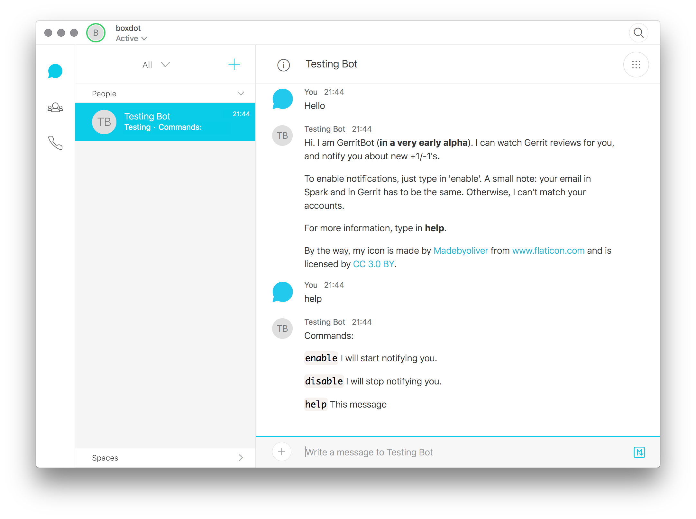

# Gerritbot [](https://travis-ci.org/boxdot/gerritbot-rs)

A [Cisco Spark](https://www.ciscospark.com) bot, which notifies you about new review approvals
(i.e. +2/+1/-1/-2 etc.) from [Gerrit](https://www.gerritcodereview.com).



## How to use:

1. Register a developer account at https://developer.ciscospark.com.
2. Create a new bot and write down its **api key**.
3. Build and run the bot in direct or SQS mode (cf. below).

```shell
$ cargo run -- <arguments>
```

The bot can run in two modes.

### Direct mode

The bot is listening on a specified endpoint for incoming incoming Spark messages. For that, you
need to provide the endpoint url to the bot by using the argument `--spark-webhook-url`. The bot
will register the url for you through the Cisco Spask API. Alternatively, you can also register the
url yourself at [https://developer.ciscospark.com](https://developer.ciscospark.com). In that case,
do not provide the option `--spark-webhook-url`, since otherwise it will overwrite you manually
configured url.

Example:

```shell
$ cargo run -- \
    --spark-webhook-url https://endpoint.example.org \
    --spark-endpoint localhost:8888 \
    --spark-bot-token <API_KEY> \
    --gerrit-hostname localhost \
    --gerrit-priv-key-path ~/.ssh/id_rsa \
    --gerrit-username gerritbot
```

In this setup, the bot is listening for the incoming messages at `localhost:8888`, where Spark will
send the messages to the endpoint `https://endpoint.example.org`. This is useful to test the bot in
a local environment. For an easy way to get a public url connected to a local endpoint cf.
[https://ngrok.com](https://ngrok.com).


### AWS SQS mode

The bot is polling the Cisco Spark messages from an AWS SQS queue provided by the
arguments `--spark-sqs` and `--spark-sqs-region`. The url of the queue can be registered in Spark in
the same way as in direct mode.

Example:

```shell
$ cargo run -- \
    --spark-webhook-url https://gateway-to-sqs.amazonaws.com/prod
    --spark-sqs https://sqs.region.amazonaws.com/account/sqs-name \
    --spark-sqs-region region \
    --spark-bot-token <API_KEY> \
    --gerrit-hostname localhost \
    --gerrit-priv-key-path ~/.ssh/id_rsa \
    --gerrit-username gerritbot
```

This is useful, when the bot is running in a private network and does not have a connection to the
internet. SQS is playing the role of a gateway between the internet and the internal traffic.

To forward the Spark messages to a SQS use an AWS API Gateway.

## Gerrit

To listen to Gerrit messages, you need to have a Gerrit user with `stream-api` access
capabilities. Admins and Non-interactive users should have such.

The state of the bot is stored in the `state.json` file in the same directory, where the bot is
running.

**This is my first Rust project. Any constructive criticism is welcome.**

## License

 * Apache License, Version 2.0, ([LICENSE-APACHE](LICENSE-APACHE) or
   http://www.apache.org/licenses/LICENSE-2.0)
 * MIT License ([LICENSE-MIT](LICENSE-MIT) or
   http://opensource.org/licenses/MIT)

### Contribution

Unless you explicitly state otherwise, any contribution intentionally submitted
for inclusion in this document by you, as defined in the Apache-2.0 license,
shall be dual licensed as above, without any additional terms or conditions.
